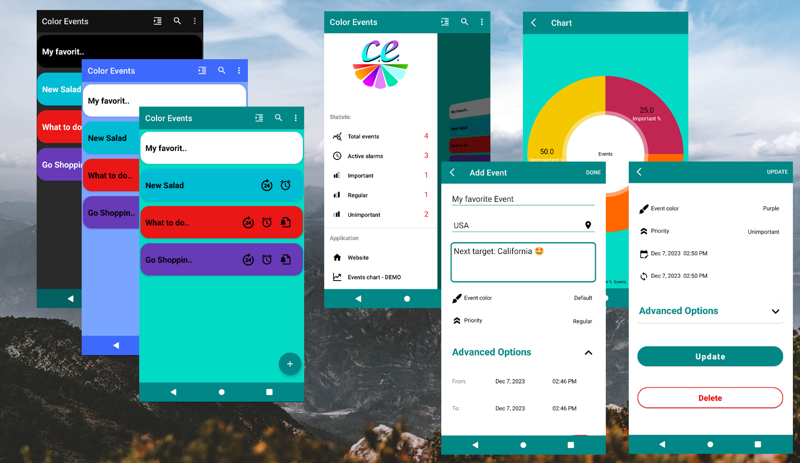
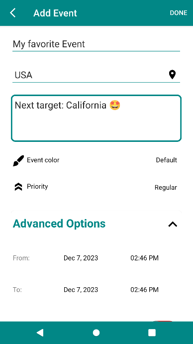
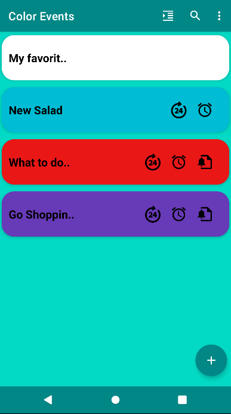
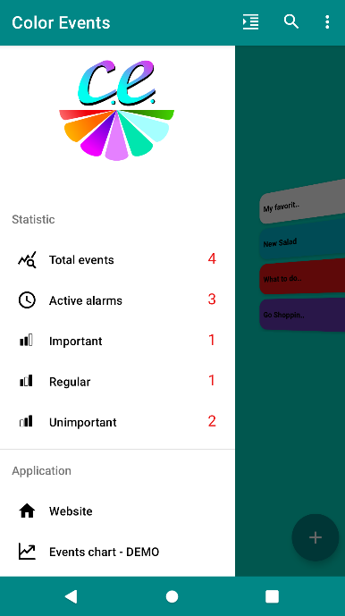
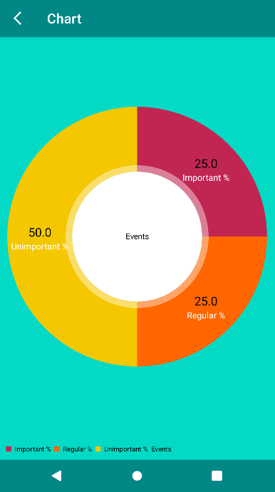
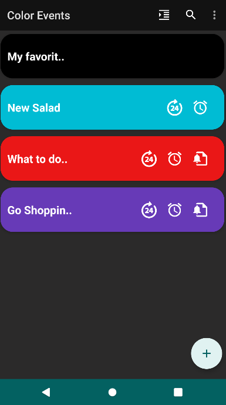
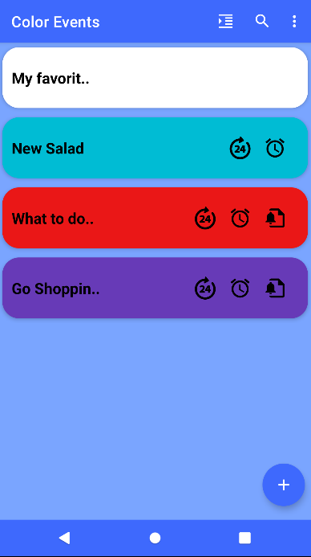
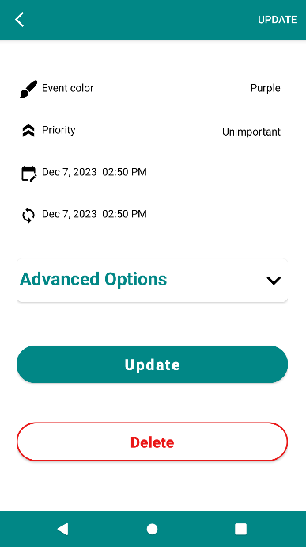
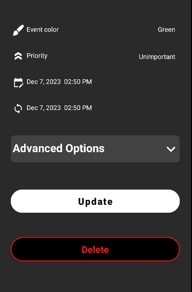
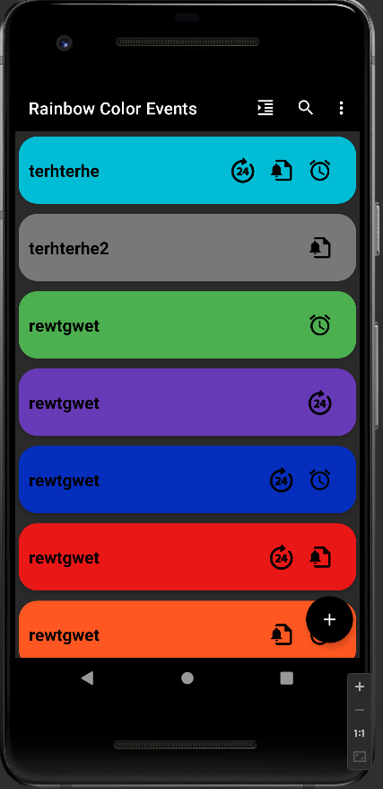

# Color-Events

# [MIT License](LICENSE)

Software architecture: MVC

Project status: in development

This is notebook for life events. 

Features: App themes, CRUD new Event, add location, avatar and priority, start-end time (time and date picker), android notifications, alarm manager, notification channels, custom dialogs, tutorial guide, navigation menu, animated views, REST requests, UI test example with Espresso.

Tools/library: SQLite,  Glide, Volley, Espresso, Shimmer, MPAndroidChart, Easypermissions

  
  
  
