# Oasis - Color Events

# [MIT License](LICENSE)

> [!IMPORTANT]
> Use of .xml vector path, .svg, .png and .bmp files, as well as all brand logos, is excluded from this license. Any use of these file types or logos requires prior permission from the respective owner or copyright holder.

## Description

This is notebook for life events.

**Features:** App themes, CRUD new Event, add location, avatar and priority, start-end time (time
and date picker), android notifications, alarm manager, notification channels, custom dialogs,
tutorial guide, navigation menu, animated views.

**Tools/library:** Java, Android framework, SQLite, OpenStreetMap, JUnit, Shimmer, MPAndroidChart,
Easypermissions, Glide, Gradle

**Software architecture:** Layered (n-tier) architecture using the MVVM (Model-View-ViewModel)
design
pattern in the presentation layer

**Project status:** in development

## Gallery

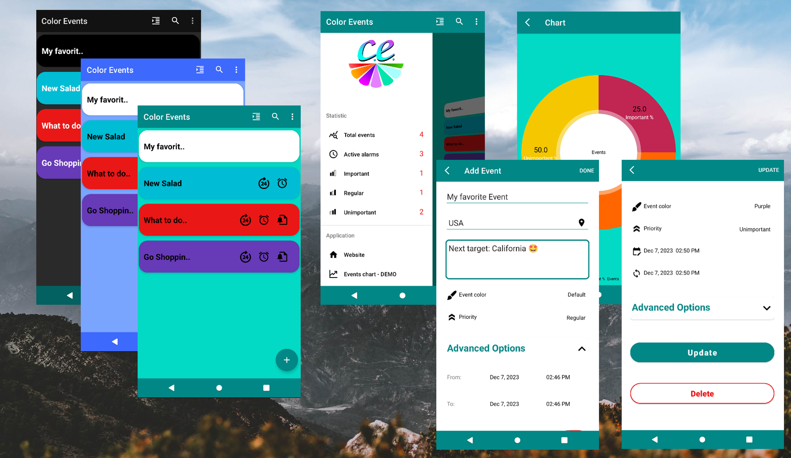

<table>
  <tr>
    <td>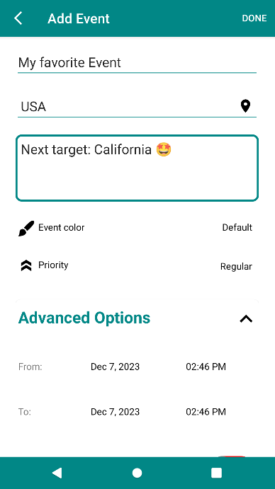</td>
    <td>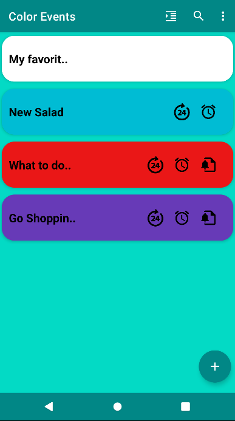</td>
    <td>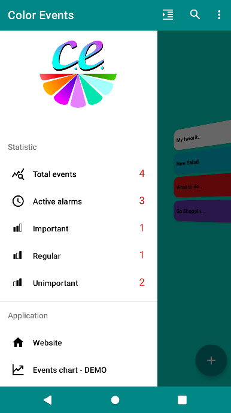</td>
  </tr>
  <tr>
  	<td>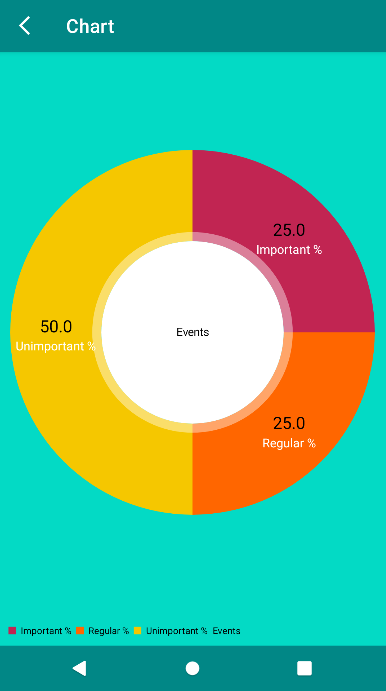</td>
    <td>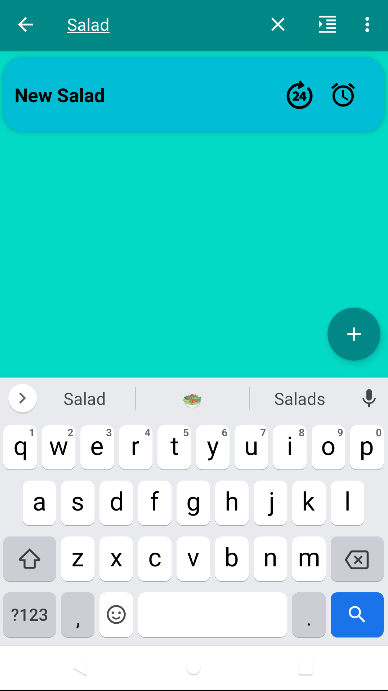</td>
    <td>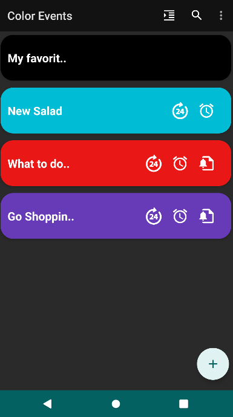</td>
  </tr>
  <tr>
  	<td>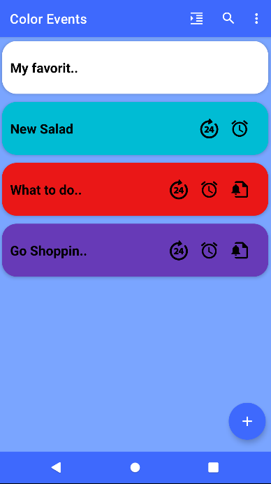</td>
    <td>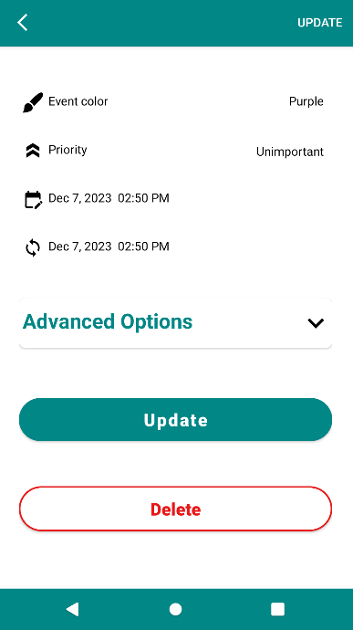</td>
    <td>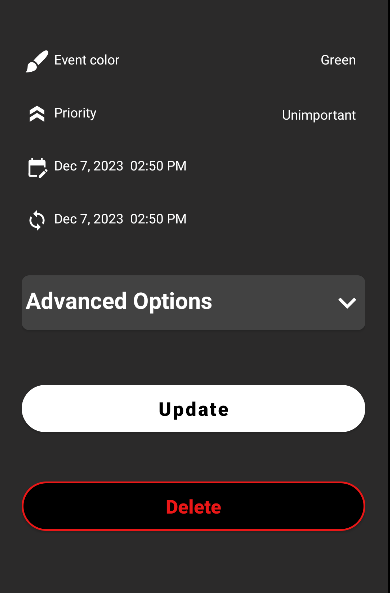</td>
  </tr>
 </table>

 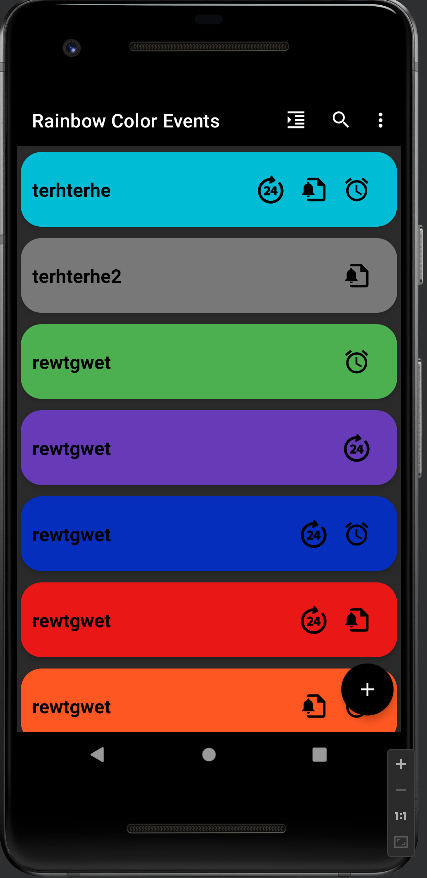

## Contact me

